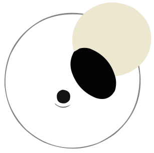
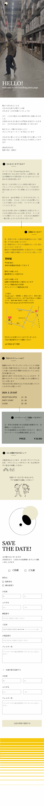

  <h1>Takashi & Eriko wedding party invitation</>

  

### Thank you for coming 💍
気になってみにきてくれたみんな、ありがとう。実はこの招待状は夫婦で自作したんだよ。最近ではWeb招待状を無料で作成できるサービスもたくさんあるので、それらに頼ることも考えた。でも、せっかくなら何事も楽しみたいという思いから自作してみた。
担当としては、ErikoがFigmaを用いてサイト全体のデザインやロゴ・動画作成、Takashiがコーディングで協力して作った。

### Tech Stack 🛠️

- Next.js
- TypeScript
- Tailwind CSS
- Google Sheets API
- Vercel

### Call for Contributions 
かなりいい加減に作ったのでバグがたくさんあると思う...
見つけた人は連絡をくれるととても嬉しいです。

### Design idea

  

